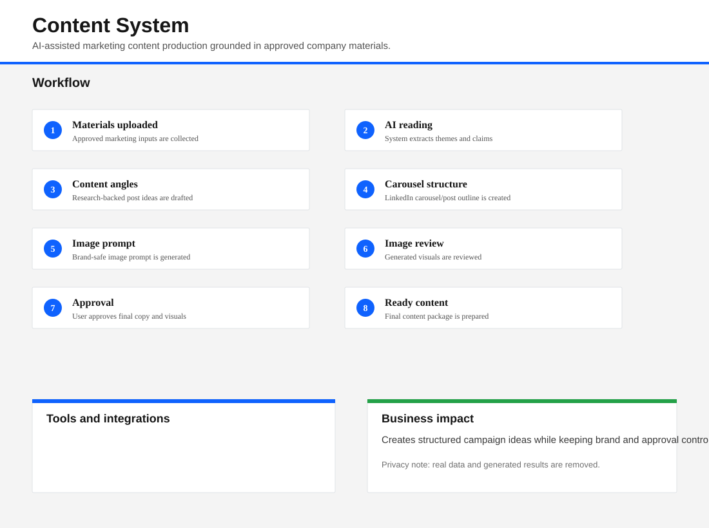

# Content System

AI-assisted marketing content production workflow that converts approved company materials into structured LinkedIn post and carousel ideas with human review.

## Problem

Marketing teams need consistent content, but generating posts from technical material is time-consuming and easy to misalign with brand rules. Real campaign outputs can include sensitive strategy, product claims, and calendar plans. A portfolio version should show the workflow without publishing any private results.

## Solution

This repository keeps the content system structure while removing real generated posts, carousel HTML, calendars, and campaign plans. It demonstrates how approved materials can feed AI-assisted research, content angles, carousel structures, image prompts, and final approval steps using only placeholder folders and dummy samples.

## Workflow Infographic

## System Architecture

- Content planning structure for source materials, output folders, and approval-ready assets.
- Placeholder output directories for carousels, single posts, video ideas, email templates, and brand assets.
- Dummy sample files showing how safe test data should look.
- AI workflow designed around approved marketing material grounding and human approval.

## Tools Used

GPT, AI image generation, approved marketing material grounding, brand style rules, content calendars, and human approval review.

## Key Features

- Marketing material ingestion concept.
- AI-generated content angle workflow.
- LinkedIn post and carousel structure workflow.
- Image prompt generation with fixed design style.
- Human review before final content is used.
- Empty output folders preserved for implementation clarity.

## Example Workflow

1. Add approved dummy marketing material.
2. Generate research angles and content themes.
3. Draft post or carousel structure.
4. Generate image prompts with brand rules.
5. Review output and approve final content.

## Business Impact

The system shows how AI can make content operations faster and more structured while still respecting brand, factual accuracy, and privacy controls. Real carousel posts, calendars, and campaign outputs have been removed so reviewers see the architecture instead of private business material.

## Security & Data Privacy

This repository is a portfolio-safe version of the system. All real client data, API keys, tender documents, CRM exports, generated proposals, calendar outputs, and operational results have been removed. Any files shown are empty placeholders or dummy samples created only to demonstrate the workflow structure.

## How to Run Locally

1. Copy `.env.example` to `.env` and add your own local credentials.
2. Run `npm install` if you add executable scripts.
3. Use the empty placeholder folders to implement your own safe workflow.
4. Keep generated outputs outside git unless they are dummy samples.

## Future Improvements

- Add a web approval queue for content drafts.
- Add brand rule validation before final export.
- Add demo-only generated examples with clearly fake data.
